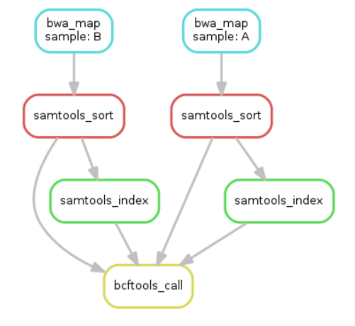

Walkthrough
========================================

We first take you through an introduction to the concepts and to snakemake.

You can get the slides :download:`here `.

DAG
-------------

A workflow can be represented as a Directed Acyclic Graph (DAG) where the nodes are processes and a directed edge connects process A to process B if B needs to run only after A has completed. Logically, this is because process B needs data as input which process A can provide! 

The graph is acyclic because a process cannot require itself to have run before running.

Here is the DAG of our example workflow:

    Read data from two samples gets mapped, sorted, indexed and variant called.

