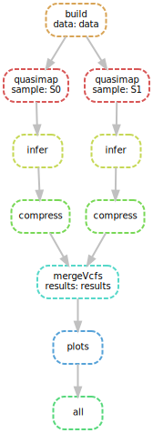

Build a full workflow
======================


The task
----------

We want to perform read mapping and variant genotyping against a genome graph, a data structure which contains known genetic variation observed in a population or a species.

We will use `gramtools <https://github.com/iqbal-lab-org/gramtools>`_ to do this, which Brice develops. 

The data
---------

We have 5 read sets from `Mycobacterium tuberculosis`, a bacterial pathogen. We also have its reference genome and a file describing known variants, in the `VCF <https://github.com/samtools/hts-specs>`_ format. The data files are in `P3/data`.

We will build a genome graph, map the reads to it, and find out which samples have which variants.


Desired workflow
-----------------



    The steps of the workflow to implement. Only two samples are shown.


Steps explained
----------------

.. table:: 
    :align: center

    ================= ====================================================== ===============================================================
     Step               Purpose                                                 Command
    ================= ====================================================== ===============================================================
    :ref:`build`      Build a genome graph from genome reference + variants  ``gramtools build {options}``
    :ref:`quasimap`   Map reads from a sample to a genome graph              ``gramtools quasimap {options}``
    infer             Infer which variants the mapped sample has             ``gramtools infer {options}``
    compress          compress a VCF file and index it for fast access       ``bgzip {file} && bcftools {file}.gz``
    mergeVcfs         combine compressed VCFs into one multi-sample VCF      ``bcftools merge -O z {inputs} > {output}``
    :ref:`plots`      make plots of the variation found (Brice's script)     ``python3 scripts/analyse_variants.py {in}.vcf.gz {outdir}``
    ================= ====================================================== ===============================================================

**Get information the command options by running them on the command-line**.

.. _build:

build
```````
This command takes a `kmer-size` option, reasonable values are < 12.


.. _quasimap:

quasimap
`````````

This command takes a `run-directory` option, which stores all results for a given sample. It used again in the ``infer`` step.

.. _plots:

plots
`````````

The script plots, given a multi-sample VCF file, i) variant density and ii) the site frequency spectrum.

This script uses the excellent python package `scikit-allel <https://scikit-allel.readthedocs.io/en/stable/index.html>`_ for analysing genetic variation, if you're interested!


Tips
--------

Writing
````````````````
Here is the Snakefile we start from:

.. literalinclude:: P3_dir/toComplete_Snakefile
        :language: python

**Keep updating the ``all`` rule with each step you add**, so that you always have a functional workflow.

Data
````````
Start by using only two samples, as in the provided `config/samples.tsv`.

Then when your workflow works with two samples, run on all of them using:: 

    mv config/all_samples.tsv config/samples.tsv
